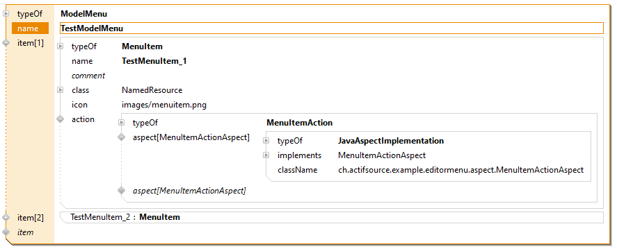

# ch.actifsource.example.editormenu
In this project we will show how to define a actifsource editor menu action.

### Project Explorer

### Domain Diagram

### Model Menu

### Menu Action Aspect

## Requirements
Actifsource  Workbench Community Edition

## License
[http://www.actifsource.com/company/license](http://www.actifsource.com/company/license)